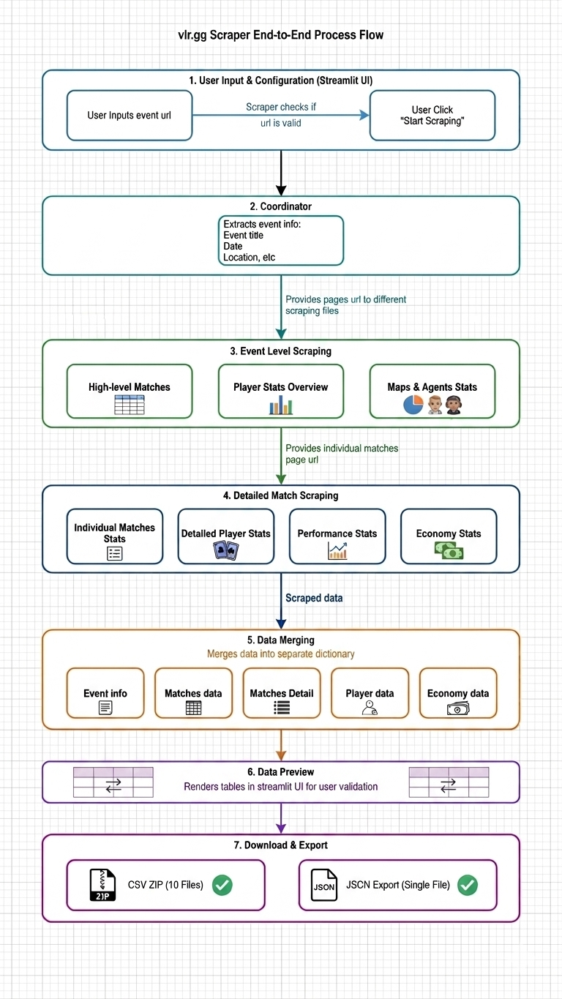

# VLR.gg Event Scraper

A modular, end-to-end scraping system for VLR.gg tournament events — extracting match results, player statistics, economy data, performance data, and detailed per-map player stats, with CSV and JSON export support.

---

## 🗺️ Process Flow



> _Diagram showing the full 8-step pipeline: from user input → coordinator → 6 scraper modules → data merge → Streamlit preview → CSV/JSON download._

---

## 🚀 Quick Start

1. **Install Python dependencies**:
```bash
pip install -r requirements.txt
```

2. **Install system dependencies** (required for Selenium/Chromium):
```bash
# Linux / Streamlit Cloud (packages.txt)
chromium
chromium-driver
```

3. **Run the application**:
```bash
streamlit run vlr_streamlit_ui.py
```

4. **Use the scraper**:
   - Enter a VLR.gg event URL (e.g., `https://www.vlr.gg/event/2097/valorant-champions-2024`)
   - Select which modules to scrape using the 6 checkboxes
   - Set a max match limit (3 / 5 / 10 / 15 / 20 / All)
   - Review the scraped data in interactive tables
   - Download as a CSV ZIP archive or a single JSON file

---

## 📁 Project Structure

```
├── vlr_streamlit_ui.py                       # Main entry point — Streamlit UI, controls, preview, downloads
├── vlr_scraper_coordinator.py                # Orchestrator — initialises scrapers, runs in sequence, merges results
├── matches_scraper.py                        # Scrapes match list: teams, scores, dates, stages, match URLs
├── player_stats_scraper.py                   # Scrapes aggregate player stats: Rating, ACS, K/D, KAST, ADR, HS%
├── maps_agents_scraper.py                    # Scrapes agent pick rates and map win rates
├── match_details_scrapper.py                 # Selenium-based: per-map player stats (All/Attack/Defense sides)
├── detailed_match_economy_scrapper.py        # Economy data: pistol/eco/semi-eco/semi-buy/full-buy per team per map
├── detailed_match_performance_scrapper_v2.py # Performance data: multikills (2K–5K), clutches (1v1–1v5), ECON/PL/DE
└── README.md                                 # This file
```

---

## 🎯 Features

### Modular Scraping (6 Modules)

| Module | Source Tab | Key Data |
|--------|-----------|----------|
| 🏆 **Matches Scraper** | `/event/matches/` | match_id, teams, scores, dates, stages, match URLs |
| 📊 **Player Stats Scraper** | `/event/stats/` | Rating, ACS, K/D, KAST, ADR, HS%, kills, clutches, FK |
| 🎭 **Maps & Agents Scraper** | `/event/agents/` | Agent pick rates per map, map win rates |
| 💰 **Economy Scraper** | `?game=all&tab=economy` | Pistol / Eco / Semi-eco / Semi-buy / Full-buy per team per map |
| ⚡ **Performance Scraper** | `?game=all&tab=performance` | 2K–5K multikills, 1v1–1v5 clutches, ECON, PL, DE |
| 🤖 **Detailed Match Scraper** | Full match pages (Selenium) | Per-player stats split by All / Attack / Defense sides |

### Data Export
- **📦 CSV ZIP Archive**: 10 individual CSV files covering all data types
- **{ } JSON Export**: Single enhanced JSON file with nested and pre-flattened structures

### User Interface
- **8-step pipeline**: Input → Validate → Event Info → Static Scraping → Per-Match Loop → Selenium → Merge → Preview → Download
- **Real-time progress**: Live scraping status updates
- **Interactive preview**: `st.dataframe()` tables, expandable per-match sections, per-map tabs

---

## 🔧 Usage Examples

### Using Individual Scrapers
```python
from matches_scraper import MatchesScraper

scraper = MatchesScraper()
matches_data = scraper.scrape_matches("https://www.vlr.gg/event/2097/valorant-champions-2024")
print(f"Found {matches_data['total_matches']} matches")
```

### Using the Coordinator
```python
from vlr_scraper_coordinator import VLRScraperCoordinator

coordinator = VLRScraperCoordinator()
data = coordinator.scrape_comprehensive(
    "https://www.vlr.gg/event/2097/valorant-champions-2024",
    scrape_matches=True,
    scrape_stats=True,
    scrape_maps_agents=True,
    scrape_economy=True,
    scrape_performance=True,
    scrape_detailed=True,
    max_matches=10  # 3 / 5 / 10 / 15 / 20 / None (All)
)
```

### Accessing Scraped Data
```python
# Result dict keys
data['event_info']        # title, dates, location, prize_pool, url
data['matches_data']      # match list + total_matches + series_info + bracket_info
data['stats_data']        # player stat dicts + total_players
data['maps_agents_data']  # agents list + maps list
data['economy_data']      # flat list of team-per-map economy records
data['performance_data']  # { total_matches, matches: [ per-match-per-map player rows ] }
data['detailed_matches']  # full match objects with maps, overall_player_stats, event_info, teams
```
---

## 🛠️ Requirements

**Python 3.12.12** (recommended; minimum 3.7+)

```
streamlit
requests
beautifulsoup4
pandas
selenium
```

**System packages** (Streamlit Cloud — `packages.txt`, saved as clean UTF-8, no BOM):
```
chromium
chromium-driver
```

---

## ⚙️ Technical Notes

### Scraper Types

**requests + BeautifulSoup4** (5 of 6 scrapers — fast, ~<5s each):
- Matches, Player Stats, Maps & Agents, Economy, Performance scrapers
- URL pattern: `/event/{id}/{name}` → tab-specific sub-paths
- Economy/Performance append query params: `?game=all&tab=economy` / `?game=all&tab=performance`
- Random 1–3 second delay between per-match requests to avoid rate limiting

**Selenium + Chromium** (Detailed Match scraper — slow, necessary):
- Required because VLR.gg renders Attack/Defense tab stats via JavaScript
- Headless Chromium, `WebDriverWait` 10s for `.wf-table-inset.mod-overview`
- 2-second grace delay after page load for final JS rendering
- Driver is quit after every match to prevent memory leaks
- ChromeDriver path: `/usr/bin/chromedriver` on Linux/Cloud; `webdriver-manager` locally

### Deployment (Streamlit Cloud)
- `packages.txt` must list `chromium` and `chromium-driver`
- `packages.txt` must be saved as **clean UTF-8 — no BOM** (use GitHub web editor)
- ChromeDriver must use `/usr/bin/chromedriver` on cloud; use `platform.system()` check to switch locally
- Large tournaments at "All" match limit can take **10–30+ minutes** for detailed scraping

---

## 📝 Example Event URLs

- **Valorant Champions 2024**: `https://www.vlr.gg/event/2097/valorant-champions-2024`
- **Masters Madrid 2024**: `https://www.vlr.gg/event/1921/champions-tour-2024-masters-madrid`
- **Masters Shanghai 2024**: `https://www.vlr.gg/event/1999/champions-tour-2024-masters-shanghai`

---

## 🔄 End-to-End Workflow

```
Step 1 → User pastes VLR.gg event URL, selects modules, sets match limit
Step 2 → Coordinator validates URL (requests.head) and fetches event metadata
Step 3 → Static scrapers run: Matches, Player Stats, Maps & Agents
Step 4 → Per-match loop: Economy & Performance scrapers iterate over match URLs
Step 5 → Selenium scraper loads each match page and extracts detailed per-map stats
Step 6 → Coordinator merges all outputs into a single result dict
Step 7 → Streamlit renders interactive preview tables
Step 8 → User downloads CSV ZIP (10 files) or single JSON export
```

---

## 📦 CSV ZIP Contents

| File | Contents |
|------|----------|
| `event_info.csv` | Tournament title, dates, location, prize pool |
| `matches.csv` | Full match list with scores and URLs |
| `player_stats.csv` | Aggregate player statistics |
| `maps_stats.csv` | Map win rates |
| `agents_stats.csv` | Agent utilization per map |
| `detailed_matches_overview.csv` | Per-match header data |
| `detailed_matches_maps.csv` | Per-map scores and metadata |
| `detailed_matches_player_stats.csv` | Per-player per-map stats (All/Attack/Defense) |
| `economy_data.csv` | Economy round breakdowns |
| `performance_data.csv` | Multikill and clutch performance |

---

## 📈 Future Enhancements

- Support for additional VLR.gg data types (head-to-head, bracket trees)
- Advanced data visualisation with Plotly dashboards
- Automated scheduling for regular scraping
- REST API endpoint creation

---

**Note**: This tool is for educational and research purposes. Please respect VLR.gg's terms of service and rate limits, and use responsibly.
